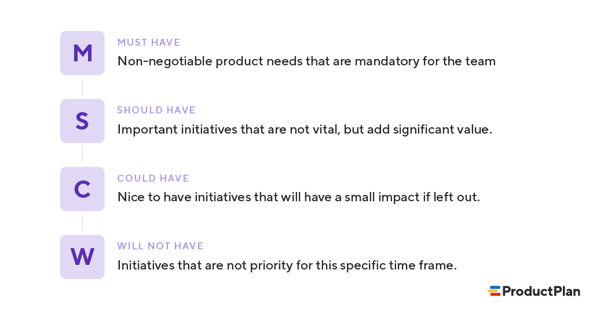

# COMP0010 - J1 - Plan

## Intro

See more from origional doc:

``COMP0010 Shell is a shell created for educational purposes. Similarly to other shells, it provides a REPL, an interactive environment that allows users to execute commands. COMP0010 Shell has a simple language for specifying commands that resembles Bash. This language allows, for example, calling applications and connecting the output of one application to the input of another application through a pipeline. COMP0010 Shell also provides its own implementations of widely-used UNIX applications for file system and text manipulation: echo, ls, cat, etc.``

### Team members

* Yadong(Adam) Liu
* Robbie(Peisen) Lin
* Huijie Yan

### Documentation (origional repo)

- [Language](doc/language.md)
- [Applications](doc/applications.md)
- [Command Line Interface](doc/interface.md)

## Software development model

* **Agile** Software development model is chosen: 
More about **Agile**: https://en.wikipedia.org/wiki/Agile_software_development


[firgure from: https://medium.com/@sudarhtc/agile-project-management-methodology-manifesto-frameworks-and-process-f4c332ddb779]

### More about Agile model
https://agilemanifesto.org/

## knowledge required for the project

* The project itself is using maven & openjdk 11. However, the project was set up as a docker project. Hence, the correct way to devlop flow is as follows

```
LOOP
  <MAKE CHANGE IN HOST MACHINE>
  <BUILD DOCKER IMAGE>
  <RUNPROJECT TEST 	INSIDE CONTAINER>
	IF (NO ERROR) -> <BUILD A RELEASE> ELSE <FIX BUG>
	<EVALUATE>
	<DOCUMENTATION>
UNTIL <FINAL PRODUCT>
```

### WORKFLOW ON GIT

#### Branches

* **Master** - This main branch of the project (PROTECTED)
	Only used for merging branches when a release is ready to be build.
* **Backup** - Contains the initial files of project (distributed from UCL).
* **dev** - Contains the current unstable version of the release

#### Submition

* When integrating a new feature, a new branch should be used & merge to the **dev** branch via **pull request** once it's been done. The branch should be deleted once the code is merged into **dev** branch (This means the feature of this branch is completed & accpeted by the memebers). Then after all testing is passed. A full release can be made into **Master** Branch. 

(PS: Remember to write unit test while implimenting a new feature)

## Program Design

* Takes are prioritized using **MoSCoW** methology
	- More info about **MoSCoW**: https://www.productplan.com/glossary/moscow-prioritization/



(Figure from: https://www.productplan.com/glossary/moscow-prioritization/)

